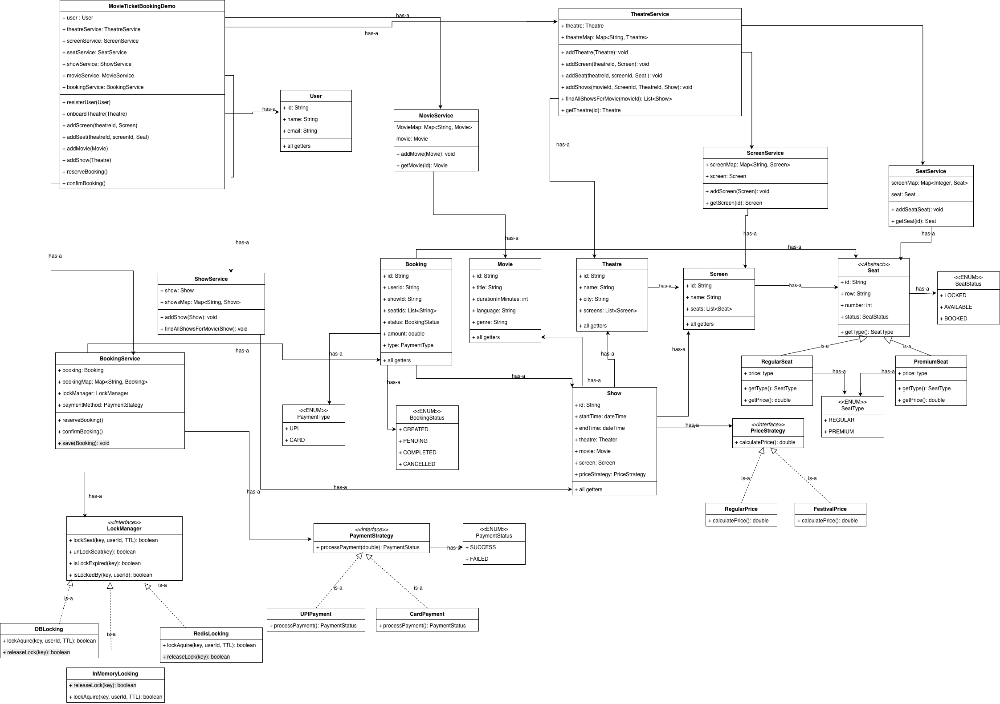

## Getting Started

This is the demo file (src/MovieTicketBookingDemo.java)

## Low Level UML diagram

## Services
1. BookingService
2. MovieService
3. ScreenService
4. SeatService
5. TheatreService
6. ShowService

## Design Pattern Used 
1. factory 
2. Strategy

# Layers
1. Entity
2. enums
3. factory
4. service
5. Strategy

# Extensibility
1. Payments
2. Seat Category
3. Pricing
4. Seat Locking